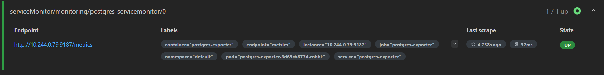
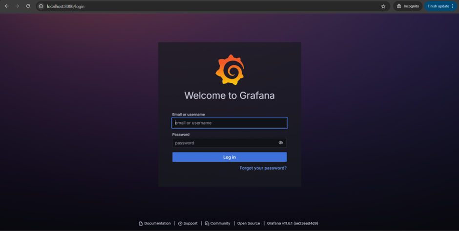
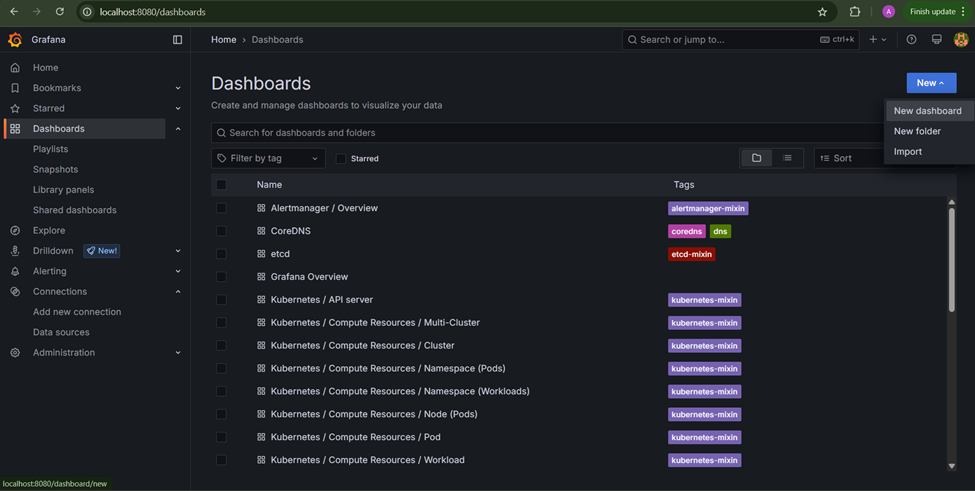
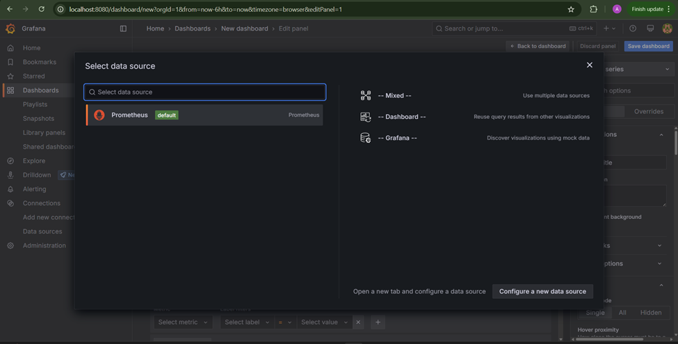
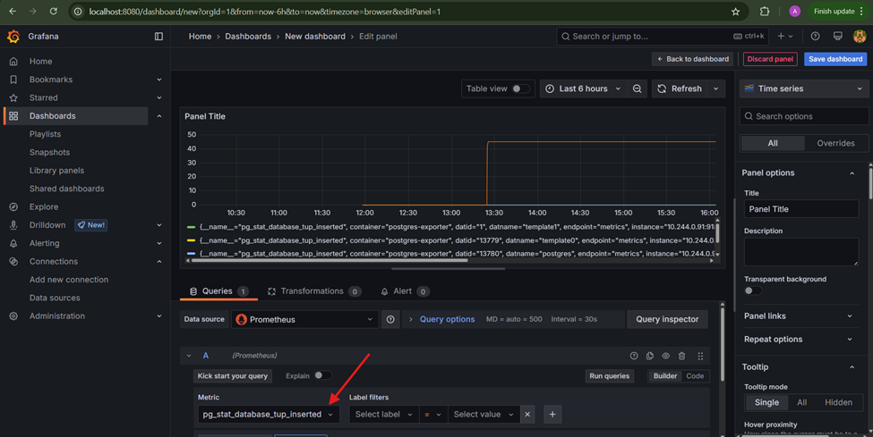

# Prometheus target scrape

Prometheus จะทำหน้าที่ "ดึงข้อมูล" จาก Exporter ต่างๆ เป็นระยะ ๆ โดย Exporter จะเป็นตัวกลางที่คอยแปลงข้อมูลจาก Service หรือระบบต่าง ๆ ให้อยู่ในรูปแบบ Metric ที่ Prometheus เข้าใจได้ จากนั้น Prometheus จะเก็บข้อมูลเหล่านั้นไว้ในฐานข้อมูลของตัวเอง

ถ้าต้องการดูข้อมูลแบบภาพรวม หรือกราฟต่าง ๆ ก็สามารถใช้ Grafana (หรือเครื่องมือ Monitoring อื่น ๆ) ดึงข้อมูลจาก Prometheus มาแสดงผลในรูปแบบ Dashboard ได้อย่างสวยงามและเข้าใจง่าย


## Installation

Install Prometheus in K8s using [Prometheus Community Helm Chart](https://github.com/prometheus-community/helm-charts).

```bash
helm repo add prometheus-community https://prometheus-community.github.io/helm-charts
helm repo update
helm install prometheus prometheus-community/prometheus --namespace monitoring --create-namespace
```

## Resource
### Postgres Service
สร้าง Target ที่จะใช้ทดสอบโดยการทดสอบครั้งนี้จะใช้ `PostgreSQL` ในการทดสอบ
```yaml
# postgres.yaml
---
apiVersion: v1
kind: Namespace
metadata:
  name: postgres
---
apiVersion: v1
kind: Secret
metadata:
  name: postgres-secret
  namespace: postgres
type: Opaque
stringData:
  POSTGRES_USER: <postgres username>
  POSTGRES_PASSWORD: <postgres password>
  POSTGRES_DB: <postgres database name>
---
apiVersion: v1
kind: PersistentVolumeClaim
metadata:
  name: postgres-pvc
  namespace: postgres
spec:
  accessModes:
    - ReadWriteOnce
  resources:
    requests:
      storage: <storage size>
---
apiVersion: apps/v1
kind: Deployment
metadata:
  name: postgres
  namespace: postgres
spec:
  replicas: 1
  selector:
    matchLabels:
      app: postgres
  template:
    metadata:
      labels:
        app: postgres
    spec:
      containers:
        - name: postgres
          image: postgres:15
          ports:
            - containerPort: 5432
          envFrom:
            - secretRef:
                name: postgres-secret
          volumeMounts:
            - name: postgres-storage
              mountPath: <postgres mount path>
      volumes:
        - name: postgres-storage
          persistentVolumeClaim:
            claimName: postgres-pvc
---
apiVersion: v1
kind: Service
metadata:
  name: postgres
  namespace: postgres
spec:
  type: ClusterIP
  selector:
    app: postgres
  ports:
    - name: postgres
      port: 5432
      targetPort: 5432
```
### Postgres Service Monitor
ServiceMonitor เป็นส่วนหนึ่งของ Prometheus Operator ที่ใช้สำหรับกำหนดให้ Prometheus ไปเก็บข้อมูล Metric จาก Service หรือ Exporter ต่าง ๆ ที่เราต้องการ

```yaml 
# postgresql-servicemonitor.yaml
apiVersion: monitoring.coreos.com/v1
kind: ServiceMonitor
metadata:
  name: postgres-servicemonitor # ชื่อของ ServiceMonito
  namespace: monitoring # Namespace ที่ Prometheus และ ServiceMonitor อยู่
  labels:
    release: kube-prometheus-stack # ใช้เชื่อมโยงกับ Prometheus instance (ผ่าน label selector)
spec:
  selector:
    matchLabels:
      app: postgres-exporter  # ระบุ label ที่ใช้หา Service ของ Exporter
  namespaceSelector:
    matchNames:
      - <postgres-namespace>  # Namespace ที่ Exporter และ Service อยู่
  endpoints:
    - port: metrics # ชื่อพอร์ตจาก Service ของ Exporter ที่เปิด path /metrics
      interval: 30s # ระยะเวลาที่ Prometheus จะดึงข้อมูล (scrape)

```
### Postgres Exporter 
1. สร้าง Pod ที่รัน postgres-exporter
2. เปิดพอร์ต `9187` และตั้งชื่อว่า `metrics`
3. ใช้ `label: app: postgres-exporter`
```yaml
# postgresql-exporter.yaml
apiVersion: apps/v1
kind: Deployment
metadata:
  name: postgres-exporter
spec:
  replicas: 1
  selector:
    matchLabels:
      app: postgres-exporter  # ต้องตรงกับ selector ของ ServiceMonitor
  template:
    metadata:
      labels:
        app: postgres-exporter
    spec:
      containers:
      - name: postgres-exporter
        image: quay.io/prometheuscommunity/postgres-exporter
        ports:
        - name: metrics
          containerPort: 9187
        env:
        - name: DATA_SOURCE_NAME
          value: "postgresql://<postgres-username>:<postgres-password>@<postgres-service>.<postgres-namespace>.svc.cluster.local:5432/<postgres-database>?sslmode=disable"
---
apiVersion: v1
kind: Service
metadata:
  name: postgres-exporter
  labels:
    app: postgres-exporter
spec:
  selector:
    app: postgres-exporter
  ports:
  - name: metrics
    port: 9187
    targetPort: 9187

```

## Verify
การตรวจสอบว่า Pod และ Service ของ Target และ Exporter ทำงานได้ตามปกติ
เพื่อให้มั่นใจว่า Prometheus สามารถดึงข้อมูล Metric ได้อย่างถูกต้อง เราควรตรวจสอบว่า Pod และ Service ของทั้ง Target (เช่น แอปพลิเคชันหลัก) และ Exporter (ตัวแปลงข้อมูลให้ Prometheus) ทำงานได้ตามปกติ โดยสามารถตรวจสอบได้ดังนี้
```bash
#Input
kubectl get all -n <postgres-namespace>
```
```bash
#Output
NAME                                     READY   STATUS    RESTARTS   AGE
pod/postgres-5d545dcfbd-4xrxs            1/1     Running   0          3h
pod/postgres-exporter-6d65cb8774-rnhhk   1/1     Running   0          171m

NAME                        TYPE        CLUSTER-IP     EXTERNAL-IP   PORT(S)    AGE
service/postgres            ClusterIP   10.0.209.208   <none>        5432/TCP   3h3m
service/postgres-exporter   ClusterIP   10.0.238.197   <none>        9187/TCP   171m

NAME                                READY   UP-TO-DATE   AVAILABLE   AGE
deployment.apps/postgres            1/1     1            1           3h3m
deployment.apps/postgres-exporter   1/1     1            1           171m

NAME                                           DESIRED   CURRENT   READY   AGE
replicaset.apps/postgres-5d545dcfbd            1         1         1       3h
replicaset.apps/postgres-697bc76ffd            0         0         0       3h3m
replicaset.apps/postgres-exporter-6d65cb8774   1         1         1       171m
```

การตรวจสอบว่า ServiceMonitor ทำงานอยู่ใน Namespace ของ Prometheus
เพื่อให้ Prometheus สามารถเก็บข้อมูลจาก Exporter ได้ จำเป็นต้องมี ServiceMonitor ที่คอยระบุว่าจะให้ Prometheus ไปดึง Metric จาก Service ไหน โดยสามารถตรวจสอบได้ดังนี้
```bash
#input
kubectl get ServiceMonitor -n <prometheus-namespace>
```
```bash
#Output
NAME                                             AGE
kube-prometheus-stack-alertmanager               3h35m
kube-prometheus-stack-apiserver                  3h35m
kube-prometheus-stack-coredns                    3h35m
kube-prometheus-stack-grafana                    3h35m
kube-prometheus-stack-kube-controller-manager    3h35m
kube-prometheus-stack-kube-etcd                  3h35m
kube-prometheus-stack-kube-proxy                 3h35m
kube-prometheus-stack-kube-scheduler             3h35m
kube-prometheus-stack-kube-state-metrics         3h35m
kube-prometheus-stack-kubelet                    3h35m
kube-prometheus-stack-operator                   3h35m
kube-prometheus-stack-prometheus                 3h35m
kube-prometheus-stack-prometheus-node-exporter   3h35m
postgres-servicemonitor                          171m
```
ตรวจสอบว่า Prometheus สามารถดึงข้อมูลจาก Target ได้หรือไม่ โดยดูจากข้อมูลในหน้า Target ดังนี้:

ทำการ forward port โดยใช้คำสั่งดังนี้
```bash
kubectl port-forward svc/kube-prometheus-stack-prometheus -n <namespace> 9090:9090
```
example
```bash
kubectl port-forward svc/kube-prometheus-stack-prometheus -n monitoring 9090:9090
```
จากนั้นให้ทำการเข้าหน้า Prometheus UI `http://localhost:9090/targets`

ตามหา Service Monitor ที่เราใช้ในการทดสอบนี้คือ 


1. สถานะ (Health)

    - ถ้าสถานะเป็น UP (สีเขียว) แสดงว่า Prometheus สามารถดึงข้อมูลจาก Target ได้ปกติ

    - ถ้าสถานะเป็น DOWN (สีแดง) หรือ UNKNOWN แสดงว่ามีปัญหาในการเชื่อมต่อหรือดึงข้อมูล

2. Last Scrape

    - แสดงเวลาที่ Prometheus ดึงข้อมูลครั้งล่าสุด เช่น "5.123s ago"

    - ถ้าหากแสดงว่า never หรือเป็นเวลานานแล้ว แสดงว่าอาจมีปัญหาในการดึงข้อมูล



ทำ Port Forwarding สำหรับ Grafana เพื่อแสดงข้อมูลบน Dashboard

ใช้คำสั่งต่อไปนี้เพื่อทำการ forward port จาก Grafana ไปยังเครื่อง local เพื่อให้สามารถเข้าถึง Dashboard ได้ผ่านเว็บเบราว์เซอร์

```bash
kubectl  port-forward service/kube-prometheus-stack-grafana -n prometheus 8080:80
```

หลังจากนั้นทำการเข้าหน้าเว็ปไซต์ผ่าน `http://localhost:8080`



ทำการ Login โดย Default username และ password ของ Gragana คือ
```
Username : admin
Password : prom-operator
```

หรือสามารถหา password โดยการใช้คำสั่ง
```bash
kubectl get secret --namespace monitoring kube-prometheus-stack-grafana -o jsonpath="{.data.admin-password}" | base64 –decode
```
จากนั้นให้เข้าหน้า Dashboard เพื่อทำการสร้าง Dashboard สำหรับ Target ที่เราต้องการ



เนื่องจากในการทดสอบครั้งนี้เป็นการใช้ Prometheus จึงเลือก Template เป็น Prometheus



จากนั้นทำการเลือก Metric ข้อมูลที่เราต้องการจะใช้



ในตัวอย่างครั้งนี้เป็น PostgreSQL metric ที่เลือกจะเป็น `pg_stat_database_tup_inserted` เป็นตัวอย่างในการแสดงผล